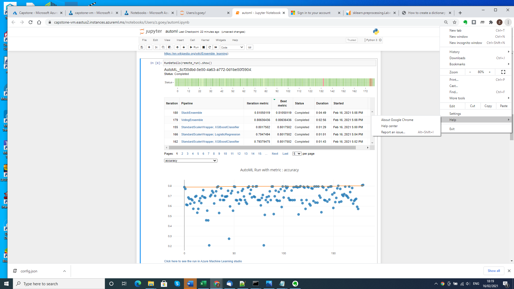
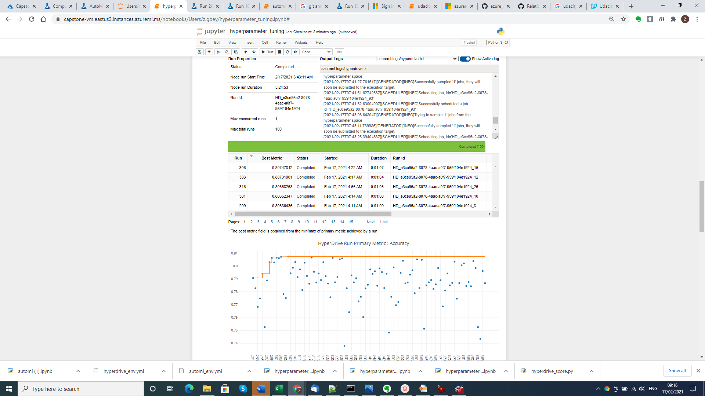
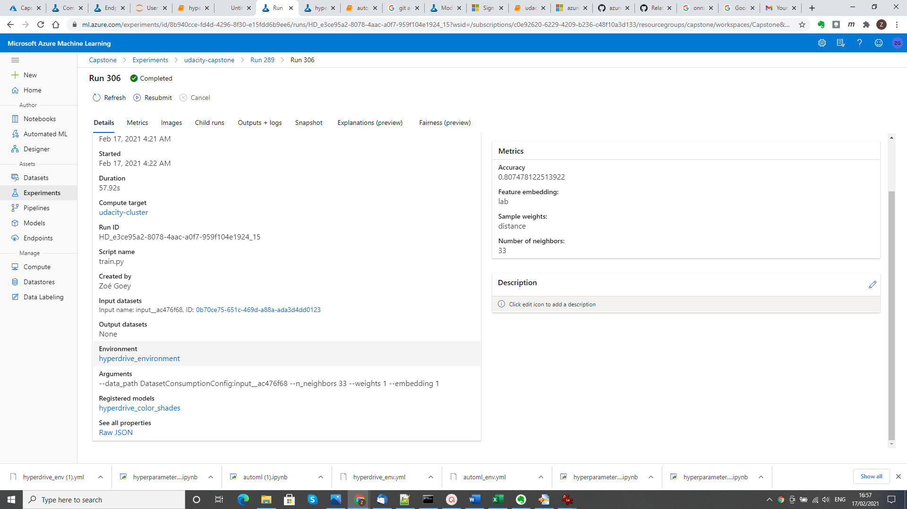
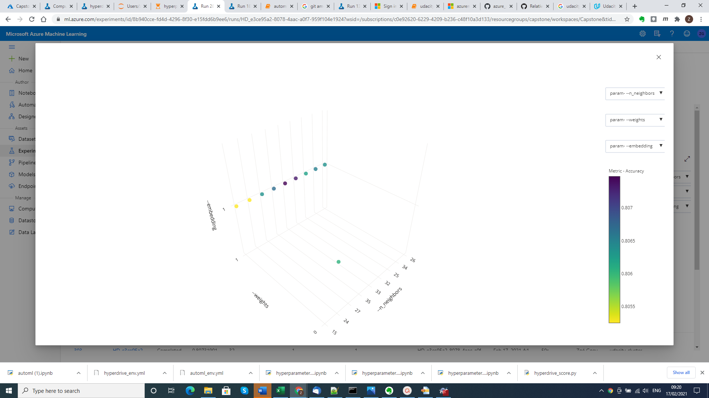
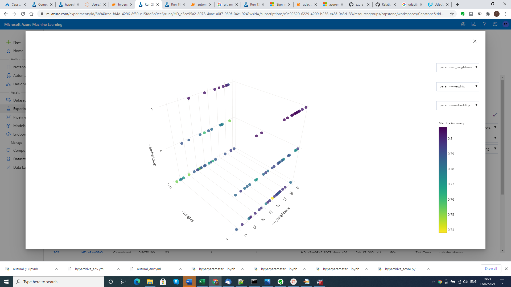

# Color shade classification

In this project we try to build a color shade classifier for RGB-triplets that can help colorblind people determine what color they are looking at. We train classifiers using AutoML and hyperparameter optimization and deploy the best model to a webservice that can then be accessed by a color shade app to determine the shade of a color match. This last step, however, is outside the scope of this project, which focuses on the machine learning part.

## Project Set Up and Installation
The project consists of two notebooks, [automl.ipynb](automl.ipynb) and [hyperparameter_tuning.ipynb](hyperparameter_tuning.ipynb), which run by default on any standard compute in AzureML. The only adaptation that we recommend to make to the standard configuration is to update the version of the AzureML SDK to match the one used on the compute clusters, thus preventing warnings when printing out AutoML model details. Another issue to remember is that the notebooks require to have the workspace configuration (config.json) inside their directories. 

This repository includes the environment (.yml) files and scoring scripts needed for deployment. In case of the AutoML experiment these are generated while running the notebook. The environment script for the deployment of the HyperDrive model is also generated within the notebook, but the scoring script [hyperdrive_score.py](hyperdrive_score.py) needs to be uploaded in advance to the directory where [hyperparameter_tuning.ipynb](hyperparameter_tuning.ipynb) can be found. 

## Dataset

### Overview
The dataset that we use can be downloaded from: https://github.com/zgoey/azure_ml_capstone/blob/master/color_shades.csv. 
Each data sample consists of a RGB-triplet and an associated basic color shade. The shades that we discern are 
white, black, grey, yellow, red, blue, green, brown, pink, orange and purple. The notebook [automl.ipynb](automl.ipynb) explains in detail how this dataset was generated. 


### Task
The problem that we wish to solve is the determination of the color shade of color patches. The features that we are going to use for this are the values of the red, green and blue channel of the color patch. The notebook automl.ipynb trains AutoML mdoels to carry out this task and the notebook hyperparameter_tuning.ipynb tries to achieve the same using hyperparameter tuning of a k-nearest-neighbor model.

### Access
Both notebooks contain code to upload the data from its web location (or, to be precise, from https://raw.githubusercontent.com/zgoey/azure_ml_capstone/master/color_shades.csv). Inside the notebooks, an Azure FileDataset is created from this web address. For the AutoML experiment, the file is then downloaded locally and converted to a TabularDataset, which can be fed to AutoML. For the HyperDrive experiment the FileDataset is passed to the training script as a mounting point.


## Automated ML
In the AutoML experiment, we set the task to classification, with the target column set to "Shade", since that is what we wish to predict. We choose accuracy as our primary metric and apply 5-fold cross-validation to be enhance the stability of the accuracy estimate. To be sure that we do not run our experiment forever, we limit the time that the experiment will run to 1 hour. Concurrency is maximally used by setting the maximum number of concurrent iterations to 4, which is the maximum that our compute cluster can deliver.

### Results
The best AutoML model is a StackEnsemble, which reaches an accuracy of 81.05%. Its meta-learner (shallow view) is given by:

| Learner                                 | Hyperparameters                                | 
| ----------------------------------------|------------------------------------------------|
| LogisticRegressionCV                    | Cs=10, class_weight=None, cv=None, dual=False, |
|                                         | fit_intercept=True, intercept_scaling=1.0,     |
|                                         | l1_ratios=None, max_iter=100,                  |
|                                         | multi_class='auto', n_jobs=None,               |
|                                         | penalty='l2', random_state=None, refit=True    |
|                                         | scoring=<azureml.automl.runtime.stack_ensemble_|
|                                         | base.Scorer object at 0x7f3205acada0>,         |
|                                         | solver='lbfgs', tol=0.0001, verbose=0          |                


Its base learners are:

| Learner                                 | Hyperparameters                                |
| ----------------------------------------|------------------------------------------------|
|                                         | base_score=0.5, booster='gbtree',              |
|                                         | colsample_bylevel=1, colsample_bynode=1,       |
|                                         | colsample_bytree=1, eta=0.3, gamma=0.01,       |
|                                         | learning_rate=0.1, max_delta_step=0,           |
|                                         | max_depth=6, max_leaves=7,                     |
|                                         | min_child_weight=1, missing=nan,               |
|                                         | n_estimators=100, n_jobs=1, nthread=None,      |
|                                         | objective='multi:softprob', random_state=0,    |
|                                         | reg_alpha=1.4583333333333335,                  |
|                                         | reg_lambda=0.625, scale_pos_weight=1,          |
|                                         | seed=None, silent=None, subsample=0.5,         |
|                                         | tree_method='auto', verbose=-10,               |
|                                         | verbosity=0)                                   |
|                                         |                                                |
| StandardScalerWrapper XGBoostClassifier | base_score=0.5, booster='gbtree',              |
|                                         | colsample_bylevel=1, colsample_bynode=1,       |
|                                         | colsample_bytree=1, eta=0.05, gamma=0,         |
|                                         | learning_rate=0.1, max_delta_step=0,           |
|                                         | max_depth=5, max_leaves=0,                     |
|                                         | min_child_weight=1, missing=nan,               |
|                                         | n_estimators=100, n_jobs=1, nthread=None,      |
|                                         | objective='multi:softprob', random_state=0,    |
|                                         | reg_alpha=1.6666666666666667,                  |
|                                         | reg_lambda=0.9375, scale_pos_weight=1,         |
|                                         | seed=None, silent=None, subsample=0.6,         |
|                                         | tree_method='auto', verbose=-10,               |
|                                         | verbosity=0                                    | 
|                                         |                                                |
| StandardScalerWrapper XGBoostClassifier | base_score=0.5, booster='gbtree',              |
|                                         | colsample_bylevel=1, colsample_bynode=1,       |
|                                         | colsample_bytree=1, eta=0.001, gamma=1,        |
|                                         | learning_rate=0.1, max_delta_step=0,           |
|                                         | max_depth=6, max_leaves=31,                    |
|                                         | min_child_weight=1, missing=nan,               |
|                                         | n_estimators=100, n_jobs=1, nthread=None,      |
|                                         | objective='multi:softprob', random_state=0,    |
|                                         | reg_alpha=1.0416666666666667,                  |
|                                         | reg_lambda=2.0833333333333335,                 |
|                                         | scale_pos_weight=1, seed=None, silent=None,    |
|                                         | subsample=0.8, tree_method='auto', verbose=-10,|
|                                         | verbosity=0                                    |
|                                         |                                                |
| StandardScalerWrapper XGBoostClassifier | base_score=0.5, booster='gbtree',              |
|                                         | colsample_bylevel=0.9, colsample_bynode=1,     |
|                                         | colsample_bytree=1, eta=0.4, gamma=0,          |
|                                         | learning_rate=0.1, max_delta_step=0,           |
|                                         | max_depth=6, max_leaves=7,                     |
|                                         | min_child_weight=1, missing=nan,               |
|                                         | n_estimators=100, n_jobs=1, nthread=None,      |
|                                         | objective='multi:softprob', random_state=0,    |
|                                         | reg_alpha=0.8333333333333334,                  |
|                                         | reg_lambda=2.291666666666667,                  |
|                                         | scale_pos_weight=1, seed=None, silent=None,    |
|                                         | subsample=1, tree_method='auto', verbose=-10,  |
|                                         | verbosity=0                                    |
|                                         |                                                |
|                                         |                                                |
| StandardScalerWrapper LogisticRegression| C=1048.1131341546852, class_weight=None,       |
|                                         | dual=False, fit_intercept=True,                |
|                                         | intercept_scaling=1, l1_ratio=None,            |
|                                         | max_iter=100, multi_class='multinomial',       |
|                                         | n_jobs=1, penalty='l2', random_state=None,     |
|                                         | solver='lbfgs', tol=0.0001, verbose=0,         |
|                                         | warm_start=False                               |
|                                         |                                                |
| StandardScalerWrapper LogisticRegression| C=51.79474679231202, class_weight=None,        |
|                                         | dual=False, fit_intercept=True,                |
|                                         | intercept_scaling=1, l1_ratio=None,            |
|                                         | max_iter=100, multi_class='multinomial',       |
|                                         | n_jobs=1, penalty='l1', random_state=None,     |
|                                         | solver='saga', tol=0.0001, verbose=0,          |
|                                         | warm_start=False                               |
|                                         |                                                |
| StandardScalerWrapper LogisticRegression| C=75.43120063354607, class_weight=None,        |
|                                         | dual=False, fit_intercept=True,                |
|                                         | intercept_scaling=1, l1_ratio=None,            |
|                                         | max_iter=100, multi_class='multinomial',       |
|                                         | n_jobs=1, penalty='l2', random_state=None,     |
|                                         | solver='saga', tol=0.0001, verbose=0,          |
|                                         | warm_start=False                               |
|                                         |                                                |
| StandardScalerWrapper XGBoostClassifier | base_score=0.5, booster='gbtree',              |
|                                         | colsample_bylevel=1, colsample_bynode=1,       |
|                                         | colsample_bytree=1, eta=0.05, gamma=0,         |
|                                         | learning_rate=0.1, max_delta_step=0,           |
|                                         | max_depth=6, max_leaves=0,                     |        
|                                         | min_child_weight=1, missing=nan,               |
|                                         | n_estimators=200, n_jobs=1, nthread=None,      |
|                                         | objective='multi:softprob', random_state=0,    |
|                                         | reg_alpha=0.625,                               |
|                                         | reg_lambda=0.8333333333333334,                 |
|                                         | scale_pos_weight=1, seed=None, silent=None,    |
|                                         | subsample=0.8, tree_method='auto',             |
|                                         | verbose=-10, verbosity=0                       |
|                                         |                                                |
| RobustScaler LightGBMClassifier         | boosting_type='gbdt', class_weight=None,       |
|                                         | colsample_bytree=0.8911111111111111,           |
|                                         | importance_type='split',                       |
|                                         | learning_rate=0.07894947368421053,             |
|                                         | max_bin=90, max_depth=3,                       |
|                                         | min_child_samples=326, min_child_weight=0,     |
|                                         | min_split_gain=0.3157894736842105,             |
|                                         | n_estimators=600, n_jobs=1, num_leaves=56,     |
|                                         | objective=None, random_state=None,             |
|                                         | reg_alpha=0.3157894736842105,                  |
|                                         | reg_lambda=0.21052631578947367, silent=True,   |
|                                         | subsample=0.4457894736842105,                  |
|                                         | subsample_for_bin=200000, subsample_freq=0,    |
|                                         | verbose=-10                                    |

Below is a screenshot of the RunDetails widget created in [auto_ml.ipynb](auto_ml.ipynb), showing the accuracy of the individual child runs:

 
 
After registration, the best model found can be viewed in Azure ML Studio:

 
 
The screenshot shows the AutoML run that was carried out  with to the right the summary of the registered best model (StackEnsemble with an accuracy of 0.81050).

Further improvements could be made by allowing AutoML to run longer than 1 hour. In fact the hyperparameter tuning using HyperDrive takes up much more time, so it would be no  more than fair to let AutoML run longer. However, since the top 10% of all runs we have seen lie within a very narrow bandwidth, we do not expect any spectacular improvement.
 
## Hyperparameter Tuning
For the hyperparameter tuning, we use  a k-nearest-neighbor model, because it is simple and at the same time flexible enough to capture complicated decision boundaries. Using Bayesian parameter sampling, we try to optimize three hyperparameters:
 1. Number of neighbors (range = {1,2,...,100})
 2. Neighbor voting weights (range = {'uniform', 'distance'})
 3. Embedding preceding neighbor search (range = {'none', 'lab', 'nac'}
Here 'lab' stands for an embedding in the (roughly) perceptually uniform  L\*a\*b\* color space, whereas 'nac' stands for Neighborhood Components Analysis. More details about these embeddings can be found in the notebook hyperparameter_tuning.ipynb.

In the hyperparameter tuning procedure, we use Bayesian parameter sampling, because our hyperparamter sample space is relatively small and we have enough budget to explore it. 
Like in our AutoML experiment, we choose accuracy as our primary metric and apply 5-fold cross-validation to be enhance the stability of its estimate. We do no set an early termination policy, because this is not supported when using Bayesian sampling. The running time, however, is restricted by setting the maximum number of runs to 100. The maximum number of concurrent runs is set to 1, to let each run benefit fully from previously completed runs, which will enhance the sampling convergence.

### Results
The best model resulting from our hyperparameter search used 33 distance-weighted neighbors in L\*a\*b\*-space and had an accuracy of 80.75%.  

Below is a screenshot of the RunDetails widget created in [hyperparameter_tuning.ipynb]hyperparameter_tuning.ipynb):

 
 
After registration, the best model can again be viewed in Azure ML Studio:

 
 
The screenshot shows the HyperDrive run corresponding to the best kNN model. To the left, we can see that it has been registered under the name "hyperdrive_color_shades" and to the right we see the metrics that were logged by the training script [train.py](train.py) (accuracy: 0.807478122513922, samle weights; distance, embedding: lab, number of neighbors: 33). 

A brief look at the 3D scatter chart of the top 10 runs and the one of all runs (see below) immediately shows what could be improved. As we can see the top 10 runs all use embedding=1, which corresponds to an embedding in L\*a\*b\* space (see [train.py](train.py)) and almost all use weights=1, which corresponds to distance-weighting. However, relatively little runs were made using this combination. So we could probably make further improvements by both fixing the embedding and weights to 1 (distance-weighting in L\*a\*b\* space) and then running another hyperparamter search over the number of neighbors. 

*3D scatter chart of the top 10 runs*


*3D scatter chart of all runs*


## Model Deployment
We actually deployed both models as can be seen in the notebooks, but since the AutoML model performed slightly better, we have only documented the AutoML model endpoint in detail. The environment file and scoring are automatically created during the AutoML training and can be found in the outputs directory after the AutoML experiment has finished. In [automl.ipynb](automl.ipynb) we copy them to the notebook directory in the last two cells before "Model Deployment" and then use them to define the inference configuration that is needed for the creation of the model endpoint. We use a deployment configuration with 1 CPU and 1GB memory. This is not necessarily an optimal configuration, but more of a working assumption inspired by example code that we have examined. Later on, we can carry out profiling to optimize out choices for the model at hand. 

In the picture below (taken from the screencast), one can see the endpoint in its active state:


Under REST endpoint (see the picture), we find the address that we can use to access the web service. If one clicks on "Consume" to the right of the "Details" tab, some sample code is provided that specifies how to send a request to the endpoint. Basically, the endpoint takes in a list of Red-Green-Blue dictionaries:

```
data = {
    "data":
    [
        {
            'Red': "24",
            'Green': "250",
            'Blue': "10",
        },
         {
            'Red': "0",
            'Green': "23",
            'Blue': "200",
        },
    ],
}
```
It then produces a list of color shade strings as a response. The exact way to address this endpoint can be found in [automl.ipynb](automl.ipynb) (second cell under "Model Deployment"), or alternatively in [endpoint_automl.py](endpoint_automl.py). 


## Screen Recording
A screencast demoing the AutoML model can be found in https://youtu.be/SowYZMnj0Ik. It shows the registered model and its endpoint, and it demonstrates how the endpoint can be used to classify a RGB-sample.

## Future improvements ##
To make this project better, the following ideas could be carried out in the future:

1. Train the AutoML longer to get a better classifier. 
2. Carry out a second hyperparameter search to get better kNN parameters. This search should solely focus on the number of neighbors; the weighting should be fixed to "distance" (--weights 1) and the embedding to "lab" (--embedding 1), since our former search has shown that this parameter combination gives the best results.
3. Give the web service a front end, so one can actually read in the RGB-values of color patches captured by a camera and get a color space back from the service
4. Save the model in ONNX-format so that it can also be used off-line in different environments.
5. Profile the model in order to determine the optimal deployment configuration.
6. Add logging to the web service so we can adequately monitor its usage once it is in production.


